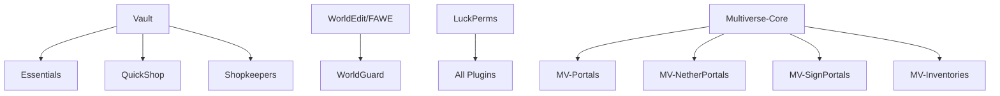

Lumo Server includes 20+ carefully selected plugins organized by functionality.

## World Management

### Multiverse-Core
**Purpose:** Multi-world management system  
**Features:** Create, delete, and manage multiple worlds  
**Commands:** `/mv create`, `/mv tp`, `/mv list`  
**Links:** [Modrinth](https://modrinth.com/plugin/multiverse-core) | [Docs](https://github.com/Multiverse/Multiverse-Core/wiki)

### Multiverse-Portals
**Purpose:** Create portals between worlds  
**Features:** Custom portal creation, portal networks  
**Commands:** `/mvp create`, `/mvp select`  
**Links:** [Modrinth](https://modrinth.com/plugin/multiverse-portals)

### Multiverse-NetherPortals
**Purpose:** Link nether portals to specific worlds  
**Features:** Custom nether portal destinations  
**Links:** [Modrinth](https://modrinth.com/plugin/multiverse-netherportals)

### Multiverse-SignPortals
**Purpose:** Create sign-based portals  
**Features:** Right-click signs to teleport  
**Links:** [Modrinth](https://modrinth.com/plugin/multiverse-signportals)

### Multiverse-Inventories
**Purpose:** Separate inventories per world group  
**Features:** Prevents creative items in survival  
**Links:** [Modrinth](https://modrinth.com/plugin/multiverse-inventories)

### VoidWorld
**Purpose:** Generate empty void worlds  
**Features:** Perfect for hub/spawn areas  
**Used in:** Hub world  
**Links:** [Modrinth](https://modrinth.com/plugin/voidworld)

## Building & Creative

### FastAsyncWorldEdit (FAWE)
**Purpose:** Efficient world editing  
**Features:** Large-scale terrain editing, async operations  
**Commands:** `//wand`, `//set`, `//copy`, `//paste`  
**Performance:** Async processing prevents lag  
**Links:** [Modrinth](https://modrinth.com/plugin/fastasyncworldedit) | [Docs](https://intellectualsites.github.io/fastasyncworldedit-documentation/)

### WorldGuard
**Purpose:** Region protection and management  
**Features:** Protect builds, set region flags, PvP zones  
**Commands:** `/rg define`, `/rg flag`, `/rg claim`  
**Links:** [Modrinth](https://modrinth.com/plugin/worldguard) | [Docs](https://worldguard.enginehub.org/en/latest/)

### PlotSquared
**Purpose:** Plot-based creative world  
**Features:** Auto-generated plots, plot claiming, merging  
**Used in:** Lumo City world  
**Commands:** `/plot claim`, `/plot auto`, `/plot merge`  
**Built from source:** Latest version for compatibility  
**Links:** [GitHub](https://github.com/IntellectualSites/PlotSquared) | [Docs](https://intellectualsites.github.io/plotsquared-documentation/)

## Compatibility & Protocol

### ViaVersion
**Purpose:** Allow newer clients to join  
**Features:** Protocol translation for newer Minecraft versions  
**Links:** [Modrinth](https://modrinth.com/plugin/viaversion) | [Docs](https://docs.viaversion.com/)

### ViaBackwards
**Purpose:** Allow older clients to join  
**Features:** Protocol translation for older Minecraft versions  
**Links:** [Modrinth](https://modrinth.com/plugin/viabackwards)

## Communication & Social

### Simple Voice Chat
**Purpose:** Proximity voice chat  
**Features:** In-game voice communication, 3D positional audio  
**Port:** 24454/udp (must be exposed)  
**Commands:** `/voice`  
**Links:** [Modrinth](https://modrinth.com/plugin/simple-voice-chat) | [Docs](https://modrepo.de/minecraft/voicechat/wiki)

## Performance & Optimization

### Chunker
**Purpose:** Pre-generate world chunks  
**Features:** Reduces lag by pre-generating terrain  
**Commands:** `/chunker start`, `/chunker pause`, `/chunker status`  
**Config:** `/data/plugins/Chunker/config.yml`  
**ENV:** `ENABLE_CHUNKER=true`  
**Links:** [Modrinth](https://modrinth.com/plugin/chunker)

### LagFixer
**Purpose:** Reduce server lag  
**Features:** Entity cleanup, chunk optimization  
**Links:** [Modrinth](https://modrinth.com/plugin/lagfixer)

## Protection & Utilities

### CoreProtect
**Purpose:** Block logging and rollback  
**Features:** Track all block changes, rollback griefing  
**Commands:** `/co inspect`, `/co rollback`, `/co restore`  
**Database:** SQLite in `/data/plugins/CoreProtect/`  
**Links:** [Modrinth](https://modrinth.com/plugin/coreprotect) | [Docs](https://docs.coreprotect.net/)

### SmoothTimber
**Purpose:** Tree felling  
**Features:** Break one log, entire tree falls  
**Links:** [Spiget](https://www.spigotmc.org/resources/smoothtimber.39965/)

### SimpleDeathChest
**Purpose:** Death chests  
**Features:** Items stored in chest on death  
**Links:** [Modrinth](https://modrinth.com/plugin/simpledeathchest)

## Permissions & Economy

### LuckPerms
**Purpose:** Advanced permissions management  
**Features:** Groups, permissions, inheritance, web editor  
**Commands:** `/lp user`, `/lp group`, `/lp editor`  
**Storage:** File-based in `/data/plugins/LuckPerms/`  
**Links:** [Modrinth](https://modrinth.com/plugin/luckperms) | [Docs](https://luckperms.net/)

### Vault
**Purpose:** Economy and permissions API  
**Features:** Provides API for economy plugins  
**Used by:** Essentials, QuickShop, Shopkeepers  
**Links:** [Spiget](https://www.spigotmc.org/resources/vault.34315/)

### EssentialsX
**Purpose:** Essential commands and economy  
**Features:** /home, /warp, /tpa, economy system, kits  
**Commands:** `/sethome`, `/home`, `/warp`, `/balance`, `/pay`  
**Config:** `/data/plugins/Essentials/`  
**Links:** [Modrinth](https://modrinth.com/plugin/essentialsx) | [Docs](https://essentialsx.net/wiki/Home.html)

## Shops & Economy

### QuickShop-Hikari
**Purpose:** Chest-based player shops  
**Features:** Create shops from chests, buy/sell items  
**Commands:** `/qs create <price>`, `/qs buy`, `/qs sell`  
**How to use:** Place chest, hold item, `/qs create <price>`  
**Links:** [Modrinth](https://modrinth.com/plugin/quickshop-hikari) | [Docs](https://github.com/Ghost-chu/QuickShop-Hikari/wiki)

### Shopkeepers
**Purpose:** NPC-based admin shops  
**Features:** Create villager/NPC shops for server economy  
**Commands:** `/shopkeeper`, `/shopkeeper give`  
**Works with:** FancyNpcs for custom models  
**Links:** [GitHub](https://github.com/Shopkeepers/Shopkeepers) | [Docs](https://github.com/Shopkeepers/Shopkeepers/wiki)

### FancyNpcs
**Purpose:** Custom NPCs  
**Features:** Create NPCs with custom skins, actions  
**Commands:** `/npc create`, `/npc edit`  
**Works with:** Shopkeepers for shop NPCs  
**Links:** [Modrinth](https://modrinth.com/plugin/fancynpcs)

## Maps & Visualization

### BlueMap
**Purpose:** Web-based 3D map viewer  
**Features:** Real-time map rendering, markers, regions  
**Access:** http://your-server:8100  
**Port:** 8100/tcp (must be exposed)  
**Config:** `/data/plugins/BlueMap/`  
**Worlds:** Pre-configured for all Lumo worlds  
**Links:** [Modrinth](https://modrinth.com/plugin/bluemap) | [Docs](https://bluemap.bluecolored.de/wiki/)

## World Generation

### Terralith (Datapack)
**Purpose:** Enhanced terrain generation  
**Features:** 100+ custom biomes, improved caves, mountains  
**Applied to:** lumo_wilds world  
**Location:** `/server/datapacks/`  
**Links:** [Modrinth](https://modrinth.com/datapack/terralith) | [Docs](https://stardustlabs.miraheze.org/wiki/Terralith)

## Plugin Dependencies

Some plugins depend on others:

**Critical plugins** (required by others):
- Vault
- LuckPerms
- Multiverse-Core
- WorldEdit/FAWE (for WorldGuard)

## Plugin Count by Category

| Category | Count |
|----------|-------|
| World Management | 6 |
| Building & Creative | 3 |
| Compatibility | 2 |
| Communication | 1 |
| Performance | 2 |
| Protection & Utilities | 3 |
| Permissions & Economy | 3 |
| Shops & Economy | 3 |
| Maps | 1 |
| **Total** | **24** |

## Adding More Plugins

See [Plugin Configuration](/lumo-server/configuration/plugins/) for how to add custom plugins.

## Next Steps

- [Plugin Configuration](/lumo-server/configuration/plugins/) - Configure installed plugins
- [Environment Variables](/lumo-server/configuration/environment/) - Plugin-related ENV vars
- [Troubleshooting](/lumo-server/reference/troubleshooting/) - Common plugin issues
